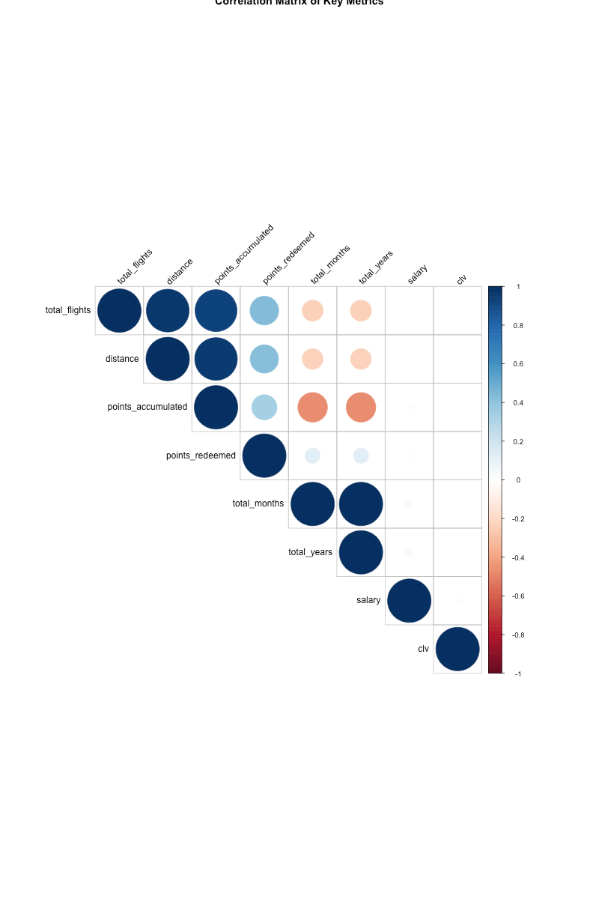
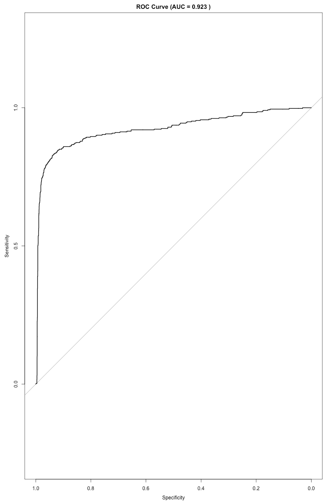
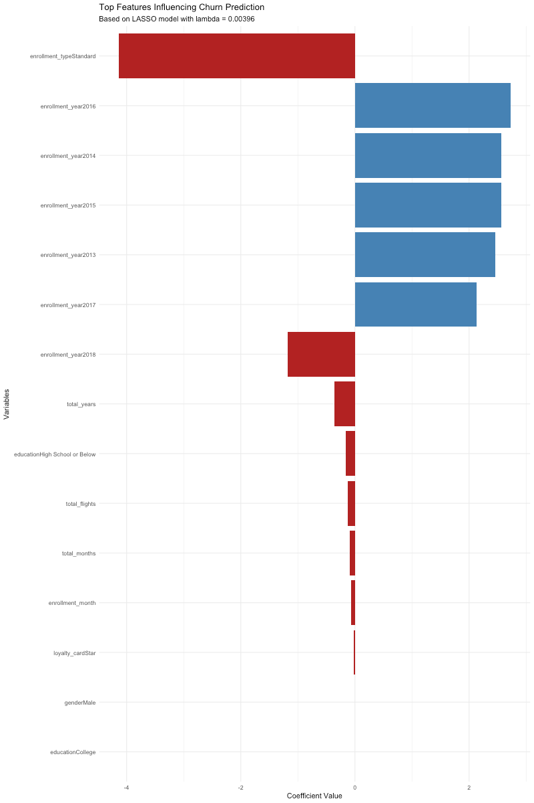

# Airline Loyalty Analysis ✈️  
Exploring churn patterns using GLMNET

# Background

Used a dummy airline loyalty program dataset to uncover predictors of churn using a logistic regression machine learning model. Check out the dashboard [here](https://public.tableau.com/app/profile/alyssa.bueno/viz/ChurnPredictionsforAirlineLoyaltyProgram/Dashboard1)!

# Executive Summary
 
This analysis identified key drivers of churn in the loyal program. Customers who earn points but never use them don't see value in staying. Flight frequency is another big predictor of churn. Occasional flyers are more likely to leave the loyalty program. The length of someone's membership makes a difference in their loyalty; people who signed up earlier are less likely to leave.

# Methods

Fit a logistic regression model using GLMNET using L1/L2 regularization to predict churners in an airlines loyalty program (dummy data) with 73% recall, 84% precision, and 95% overall accuracy.

# Key Model Metrics

- Accuracy: 94.92%
- Sensitivity (Recall): 72.88%
- Specificity: 98.02%
- Precision: 83.84%
- F1 Score: 78% (at threshold 0.75)
- AUC: 0.923

## Recommendations

Because of our model, we can predict who's likely to churn before they do. High-risk members can be sent targeted offers that can remind them to use their points and provide additional promotions to help them utilize the benefits of the program!

# Visualizations

- the top predictor of churn is enrollment_typeStandard, with a strong negative coefficient, meaning users on this plan are significantly less likely to churn. enrollment_years 2014–2016 have the highest positive coefficients, indicating those cohorts are at greater churn risk compared to the reference year.

- features like total_years, total_flights, and education level show smaller but consistent associations—users with more tenure, more flights, or higher education tend to be slightly more retained. overall, plan type and cohort year are the most influential drivers in the model.

